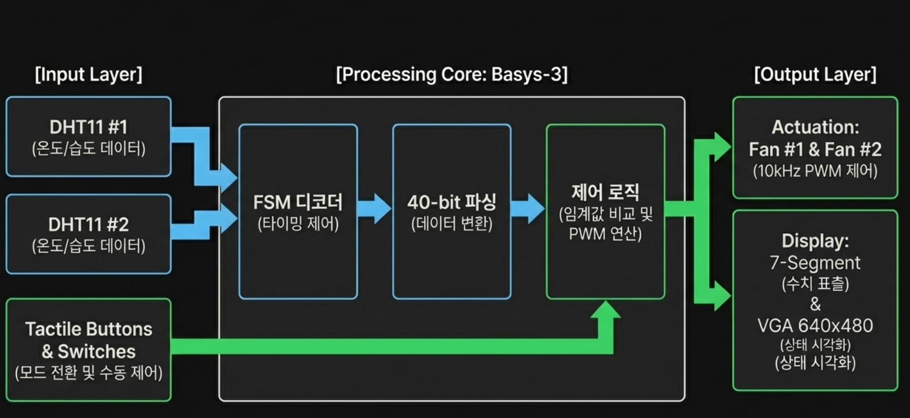
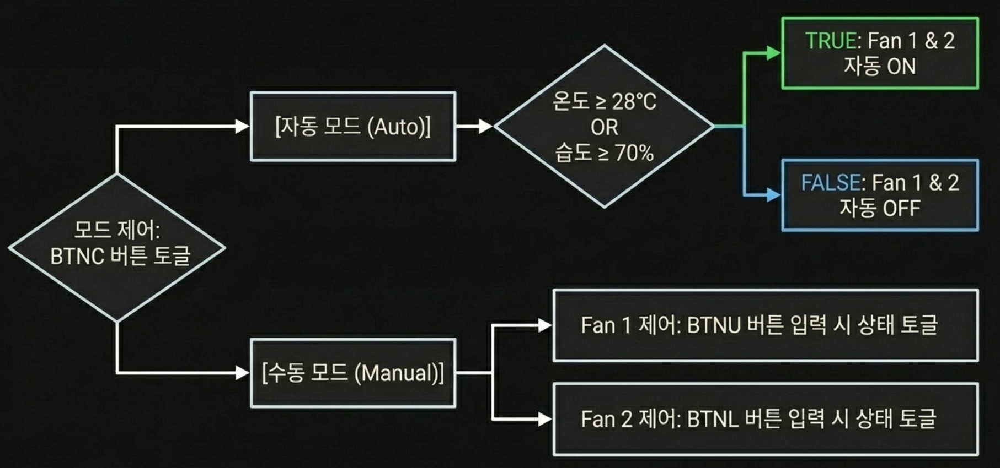
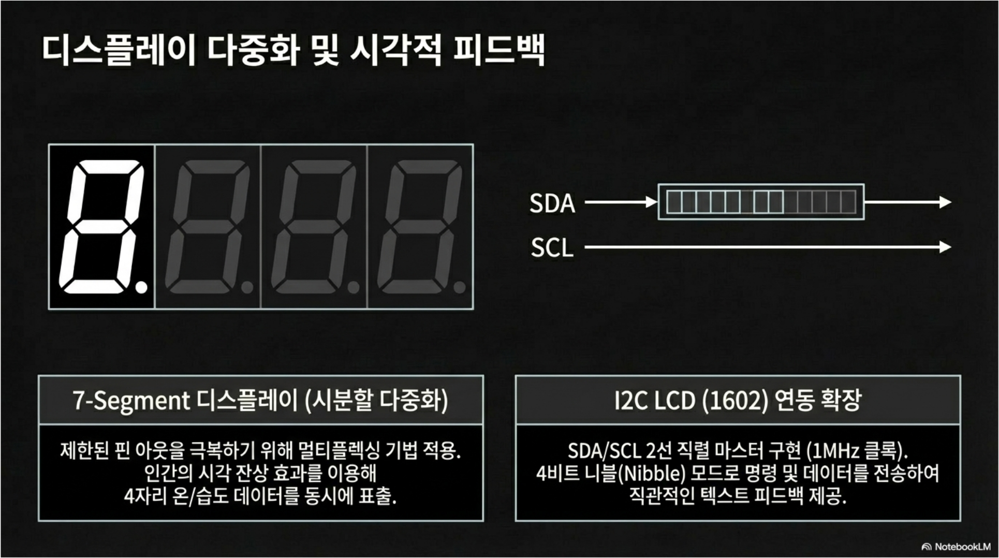
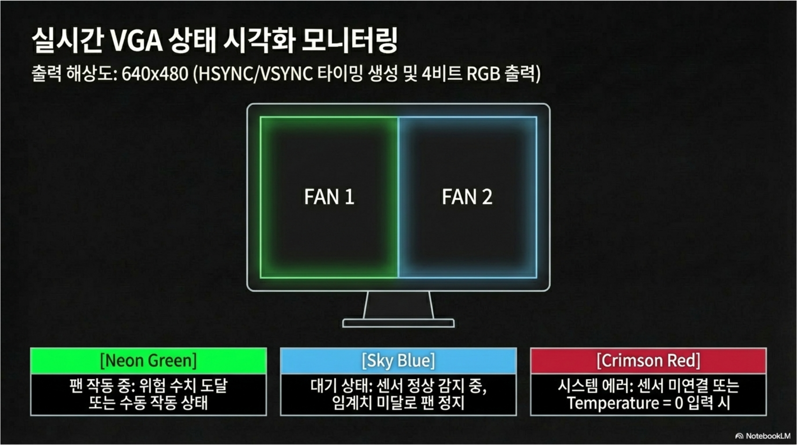

# 🌀 Project 4 Ceiling AirCirculator

## **1. Project Summary (프로젝트 요약)**
Basys3 FPGA 보드에서 Verilog RTL 설계로 구현한 온도 감지 기반 자동 공기순환 제어 시스템


## 2. Key Features (주요 기능)

### 🌡️ Temperature Sensing (온도 감지)

- 온도 센서 데이터를 실시간으로 읽어 팬 동작 여부 및 속도를 결정
- 온도 임계값(Threshold)에 따라 자동으로 동작 모드 전환

### 💨 Dual Fan Control (듀얼 팬 제어)

- 두 개의 팬을 독립적으로 제어하는 `fan_dual_system_top` 최상위 모듈 구조
- PWM 신호를 통해 팬 회전 속도를 단계적으로 조절
- 온도 구간에 따른 팬 조합 제어 (단일 동작 / 동시 동작)

### 🔄 FSM-based State Management (상태 머신 기반 제어)

- 유한 상태 머신(FSM)으로 시스템 동작 상태를 명확하게 관리
- 온도 범위별 상태 전이(State Transition) 로직 구현


## 🛠 3. Tech Stack (기술 스택)

### 3.1 Language (사용 언어)


### 3.2 Development Environment (개발 환경)

|  |  |
| :---: | :---: |
| **AMD Vivado** | **VS code** |

### 3.3 Collaboration Tools (협업 도구)


## 📂 4. Project Structure (프로젝트 구조)

### 4.1 Project Tree (프로젝트 트리)

```
Project_4/
├── RTL_Design/                              # Vivado 프로젝트 디렉토리
│   └── RTL_Design.srcs/
│       ├── sources_1/
│       │   └── new/
│       │       └── project_b.v             # 팬 이중 제어 시스템 전체 RTL 소스
│       │           ├── fan_dual_system_top # 최상위 모듈 (Top Module)
│       │           ├── temp_sensor_ctrl    # 온도 센서 데이터 수집 및 임계값 판단
│       │           ├── fsm_controller      # 동작 상태 전이 FSM
│       │           ├── pwm_gen             # PWM 신호 생성기 (팬 속도 제어)
│       │           └── fan_driver          # 팬 구동 출력 로직
│       ├── constrs_1/
│           └── imports/fpga/
│               └── Basys-3-Master.xdc      # Basys3 I/O 핀 제약 조건
│
│
├── .gitignore
├── RTL_Design.tcl                           # Vivado 프로젝트 복원 Tcl 스크립트
└── README.md                                # 프로젝트 전체 가이드 문서
```

### 4.2 Hardware BlockDiagram (하드웨어 블록다이어그램)



### 4.3 Flow Chart (순서도)



### 4.4 시스템 상세 구성





## 🏁 5. Demonstration (시연영상)

### Demonstration (시연 영상)

<a href="https://youtu.be/iMNkvyhp4iY" target="_blank">
  
</a>

*이미지를 클릭하면 시연 영상(유튜브)으로 이동합니다.*


## 6. Troubleshooting (문제 해결 기록)

### 6.1 LCD 기기 작동 구현 실패

🔍 **Issue (문제 상황)**

- 원래 계획이던 **CLCD (HD 44780)** 의 **I2C**통신이 실패하여 활용하지 못함

❓ **Analysis (원인 분석)**

- Verilog에서의 타이밍 구현이 미숙

❗ **Action (해결 방법)**

- VGA를 활용한 모니터 출력으로 대채방안 마련

✅ **Result (결과)**

- DHT11의로 나오는 출력값을 대체하여 보여줌

---

### 6.2 출력 채널의 혼동

🔍 **Issue (문제 상황)**

- 실제로 작동시킨 **Fan**이 어느쪽의 채널인지 불확실함

❓ **Analysis (원인 분석)**

- 2개의 채널을 이용하는데 표시하는 부분이 없음

❗ **Action (해결 방법)**

- VGA를 통해 1번, 2번 채널을 표시하고 켜져있는지 꺼져 있는지 확인

✅ **Result (결과)**

- 실제로 어디 부분에서 잘못되었는지 파악이 빨라져서 디버깅이 쉬워짐
